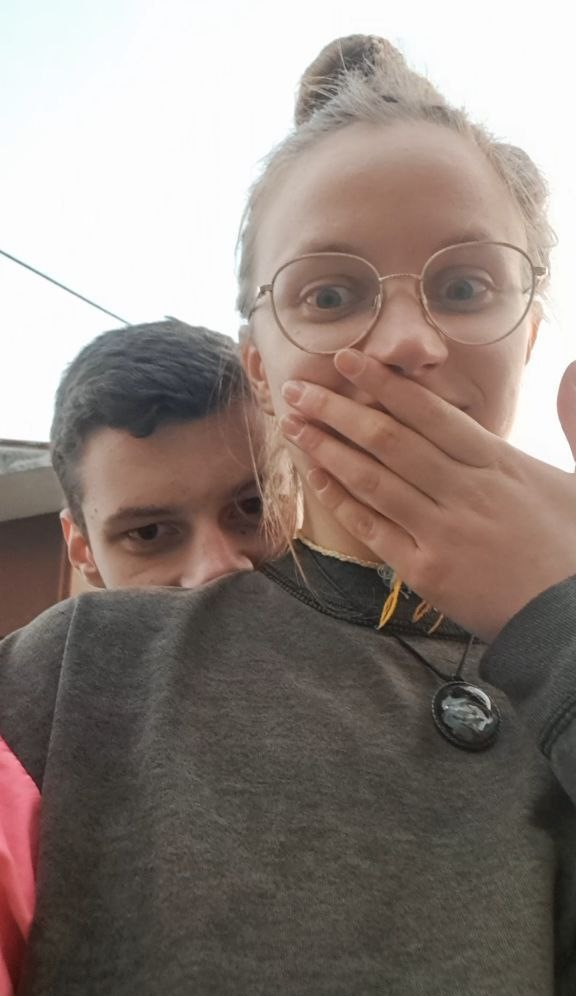
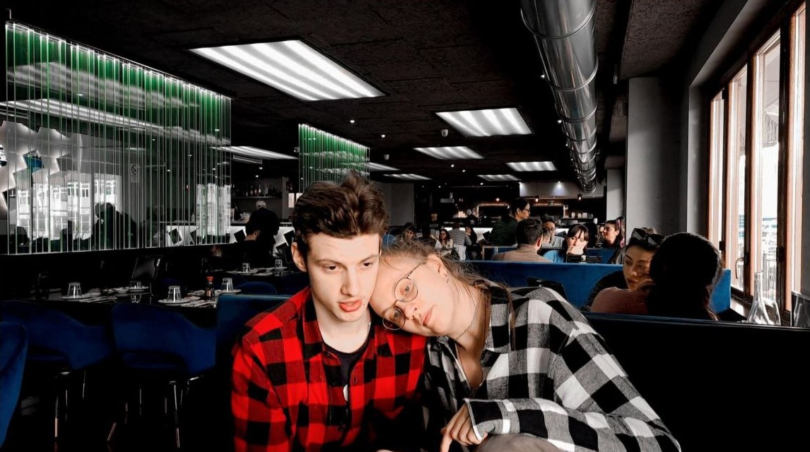

<!DOCTYPE html>
<html lang="uk">
<head>
  <meta charset="UTF-8">
  <meta name="viewport" content="width=device-width, initial-scale=1.0">
  <title>Моє кохання до тебе</title>
  
</head>
<body>
  

    <h1>Моє кохання до тебе</h1>
    
Кохана, ти – моє натхнення, моя радість і підтримка. Я звісно безмежно вдячний за те, що ти є в моєму житті.

    
    
З тобою я відчуваю справжнє щастя. Ти моє сонечко яке наповнює мене теплом та любов’ю. Я хочу, щоб ти завжди знала, як сильно я тебе кохаю.

    

      
      
      
    

    

      
“Любов – це не чекання дощу закінчення, це про танці під дощем.”

      
“Разом ми – найкраща команда.”

    

    
Кіця, разом ми пройдемо всі шляхи, всі бурі й сонячні дні.

    <a href = "index.html" class="contact-btn">КОХАТИ</a>
  

</body>
</html>
